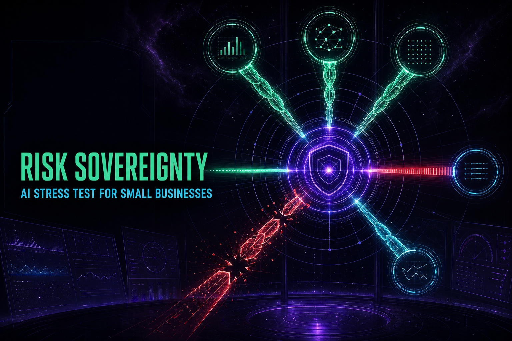
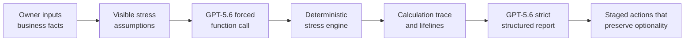

# Risk Sovereignty

**An AI red team for small businesses that finds the first financial failure point and builds a staged survival plan that preserves the owner's next move.**



Most business software optimizes for growth. Risk Sovereignty starts with a different question: _if the world stops cooperating, what breaks first?_ The app turns editable business facts and visible stress assumptions into a deterministic cash-flow diagnosis, then asks GPT-5.6 to challenge the scenario and design three reversible interventions.

Built for the **OpenAI Build Week 2026 — Work & Productivity** track.

**Live demo:** <https://risk-sovereignty.dewy-spool-9953.chatgpt.site>

Judges: start with the [90-second Judge Guide](docs/JUDGE_GUIDE.md). The repository also includes the [under-three-minute demo script](docs/DEMO_SCRIPT.md).

## Why this is not an AI wrapper

The model is deliberately not allowed to invent the financial truth.



- **Inputs are facts:** GPT-5.6 cannot silently rewrite them.
- **Assumptions are visible:** revenue, margin, payment, customer, debt, and inventory shocks remain editable.
- **Calculations are deterministic:** the local engine owns stressed cash flow, one-time shock, runway, stage, and the first failing lifeline.
- **AI owns judgment:** it challenges assumptions, explains the causal chain, and proposes a staged response.
- **Evidence remains inspectable:** every action must cite a calculation-trace or assumption ID.

The product principle is **survival before maximization**: remove risk in pieces, avoid irreversible panic, and preserve exit rights for the next decision.

## GPT-5.6 workflow

The server route uses the OpenAI Responses API in two passes:

1. Force GPT-5.6 to call `calculate_stress_test` using a strict function schema.
2. Normalize the arguments and run the calculation locally.
3. Return the tool output to the same reasoning chain.
4. Require a strict JSON Schema report with a causal chain, exactly three phases, critical assumptions, and an owner question.

The API key is read only on the server from `OPENAI_API_KEY`. It is never bundled into the client.
Successful reports expose the model name, workflow stages, and both OpenAI response IDs in the on-screen audit strip so judges can distinguish a real GPT-5.6 run from the deterministic fallback. The public demo route also applies request-size checks, a per-client demo rate limit, a 75-second upstream timeout, and no-store response headers.

## Product experience

- Chinese and English interface
- Seven editable industry demo presets
- Live “bad weather” sliders
- Five lifelines: cash, margin, collection, leverage, concentration
- 6-month hard test and first-failure diagnosis
- Four survival stages: signal, trend, contagion, emergency
- GPT-5.6 AI red-team report with deterministic local fallback
- Explicit input / assumption / calculation / AI audit boundary
- Responsive deep-space neon interface derived from the original C visual prototype

## Run locally

Requirements: Node.js `>=22.13.0`.

```bash
npm install
cp .env.example .env.local
# Add your OpenAI API key to .env.local
npm run dev
```

Open <http://localhost:3000>. The numerical experience works without a key; the AI report uses a clearly labelled deterministic fallback until the server secret is configured.

## Verify

```bash
npm run build
npm test
npm run lint
npx tsc --noEmit
```

Tests cover deterministic monotonicity and input normalization as well as production server rendering. The project targets vinext/Cloudflare-compatible deployment.

## Project map

- `app/RiskSovereigntyApp.tsx` — interactive bilingual product
- `app/api/diagnose/route.ts` — server-only GPT-5.6 Responses API orchestration
- `lib/engine.ts` — deterministic financial stress engine and tool schema
- `tests/engine.test.mjs` — engine invariants and hostile-input checks
- `tests/rendered-html.test.mjs` — production-render smoke tests

## Build Week provenance

Before Build Week, this concept existed as a single-file visual/calculation prototype. The competition version is a meaningful new extension created during Build Week: a deployable full-stack application, OpenAI Responses API integration, forced deterministic tool execution, strict structured outputs, a bilingual UI, an auditable evidence boundary, server-side key handling, automated tests, and deployment packaging.

This disclosure is intentional so judges can distinguish prior concept work from the implementation evaluated for Build Week.

## Responsible-use boundary

Risk Sovereignty is decision support, not accounting, legal, lending, or investment advice. It does not predict the future. Users should validate assumptions and obtain qualified advice before consequential action.

For a public deployment, also set a hard monthly budget and notification threshold on the dedicated OpenAI API project. The in-app rate limiter is defense in depth, not a replacement for a platform spending cap.

## License

[MIT](LICENSE)
