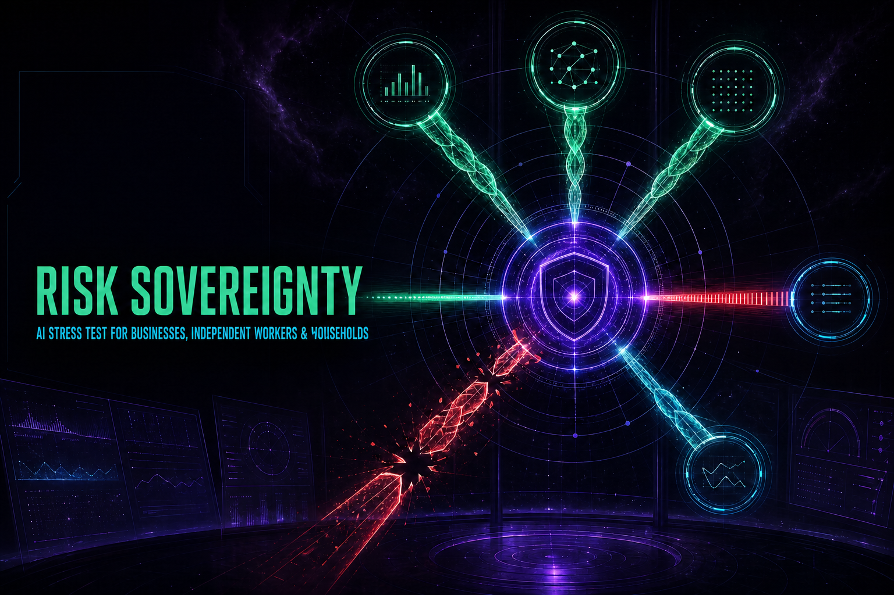
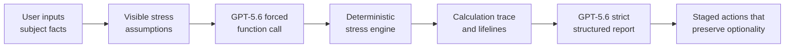

# Risk Sovereignty

**An AI red team for U.S. businesses, independent workers, and households that simulates a bad future, finds the first structural failure point, and preserves the right to exit in stages.**



Most financial software optimizes a forecast. Risk Sovereignty starts with a different question: _if the world stops cooperating, what breaks first?_ It does not claim to predict the future. It lets a user construct an explicit bad future, reveals the first point at which the structure loses optionality, then asks GPT-5.6 to challenge the scenario and design three reversible interventions.

The same founder-developed method now works across three distinct U.S. structures without pretending they share one balance sheet:

- **Employer businesses:** sector, size context, sales, gross margin after COGS, fixed cash commitments, receivables, inventory, near-term debt, and customer concentration.
- **Nonemployers / sole proprietors:** owner-only operating economics with client, platform, working-capital, and debt concentration.
- **Individuals / households:** take-home labor income, essential spending, rent or mortgage, recurring debt payments, credit cards, other consumer debt, cash, accessible reserves, income-producing assets, their carrying costs, and primary-income concentration.

Built for the **OpenAI Build Week 2026 — Work & Productivity** track.

**Live demo:** <https://risk-sovereignty.dewy-spool-9953.chatgpt.site>

Judges: start with the [90-second Judge Guide](docs/JUDGE_GUIDE.md). The repository also includes the [under-three-minute demo script](docs/DEMO_SCRIPT.md) and the founder-developed [Risk Sovereignty Method](docs/METHODOLOGY.md).

## Why this is not an AI wrapper

The model is deliberately not allowed to invent the financial truth.



- **Inputs are facts:** GPT-5.6 cannot silently rewrite them.
- **Assumptions are visible:** revenue, margin, payment, customer, debt, inventory, labor-income, asset-income, and asset-value shocks remain editable.
- **Calculations are deterministic:** the local engine owns stressed cash flow, immediate liquidity shock, economic impairment, runway, stage, and the first failing lifeline.
- **AI owns bounded judgment:** it challenges assumptions, tests whether the exit is real, separates decision quality from outcome, and proposes a staged response.
- **Evidence remains inspectable:** every action must cite a calculation-trace or assumption ID.
- **Method compliance is checked:** a post-generation audit rejects invented evidence, missing sovereignty fields, or reordered action phases.

The product principle is **survival before maximization, participation after protection**: remove risk in pieces, verify that exits really exist, preserve re-entry resources, and keep a bounded path to the upside. It is not a philosophy of hiding from risk; it is a structure for entering meaningful opportunities without allowing one loss to erase the next move.

## GPT-5.6 workflow

The server route uses the OpenAI Responses API in two passes:

1. Force GPT-5.6 to call `calculate_stress_test` using a strict function schema.
2. Normalize the arguments and run the calculation locally.
3. Return the tool output to the same reasoning chain.
4. Require a strict JSON Schema report with a causal chain, a sovereignty gate, exactly three phases, critical assumptions, and an owner question.
5. Run a deterministic semantic audit over phase order and evidence references before returning the report.

The API key is read only on the server from `OPENAI_API_KEY`. It is never bundled into the client.
Successful reports expose the model name, workflow stages, and both OpenAI response IDs in the on-screen audit strip so judges can distinguish a real GPT-5.6 run from the deterministic fallback. The public demo route also applies request-size checks, a per-client demo rate limit, a 75-second upstream timeout, and no-store response headers.

## U.S. market calibration

The interface uses USD thousands, U.S. Census regions, and common U.S. structures. Employer-sector choices are drawn from the most numerous Census County Business Patterns sectors; employee bands are context only and are not presented as legal SBA size determinations. The nonemployer mode reflects the Census definition of businesses with no paid employees, most of which are self-employed sole proprietors. Household scenarios are grounded in the Federal Reserve's recurring categories of income volatility, job interruption, housing costs, credit-card and consumer debt, major expenses, and commonly held financial or income-producing assets.

Household asset returns are modeled as a second cash-flow channel rather than merged into wages. Users enter gross monthly rent, dividends, distributions, or other payouts separately from recurring mortgage, tax, insurance, management, maintenance, and similar carrying costs. A scenario can interrupt the income while costs continue. It can also reduce asset equity or market value without pretending that a paper loss instantly left the bank account. Asset presets are editable examples—not performance forecasts, allocation advice, or hidden benchmarks.

No hidden industry, size, or regional multiplier changes a user's numbers. Public data selects understandable fields and presets; submitted facts remain authoritative.

Primary references:

- [U.S. Census Bureau — County Business Patterns API](https://www.census.gov/data/developers/data-sets/cbp-zbp/cbp-api.html)
- [U.S. Census Bureau — 2023 Nonemployer Statistics](https://www.census.gov/newsroom/press-releases/2025/2023-nonemployer-statistics.html)
- [Federal Reserve — Economic Well-Being of U.S. Households in 2025](https://www.federalreserve.gov/publications/2026-economic-well-being-of-us-households-in-2025-executive-summary.htm)
- [Federal Reserve — 2025 SHED Appendix B: Assets](https://www.federalreserve.gov/publications/2026-supplemental-appendixes-report-economic-well-being-us-households-2025-appendix-b.htm)
- [Federal Reserve Bank of New York — Household Debt and Credit](https://www.newyorkfed.org/householdcredit/hhdc-iframe)
- [Federal Reserve Small Business Credit Survey — 2025 Employer Firms](https://www.fedsmallbusiness.org/reports/survey/2025/2025-report-on-employer-firms)
- [IRS Publication 527 — Residential Rental Property](https://www.irs.gov/publications/p527)
- [Investor.gov — Mutual Funds and ETFs](https://www.investor.gov/introduction-investing/investing-basics/investment-products/mutual-funds-and-exchange-traded-funds-etfs/mutual-funds)

## Product experience

- Chinese and English interface
- Three subject modes with 23 editable U.S. profile presets
- Census-region and employee/household-structure context
- Live “bad weather” sliders
- Subject-aware lifelines: operating cash/margin/collection/leverage/concentration or household liquidity/labor income/housing/debt service/income concentration/asset return
- 6-month hard test and first-failure diagnosis
- Four survival stages: signal, trend, contagion, emergency
- GPT-5.6 AI red-team report with deterministic local fallback
- Sovereignty gate: exit reality, maximum tolerable loss, re-entry condition, preserved upside, and decision quality
- Explicit input / assumption / calculation / AI audit boundary
- Responsive deep-space neon interface derived from the original C visual prototype

## Run locally

Requirements: Node.js `>=22.13.0`.

```bash
npm install
cp .env.example .env.local
# Add your OpenAI API key to .env.local
npm run dev
```

Open <http://localhost:3000>. The numerical experience works without a key; the AI report uses a clearly labelled deterministic fallback until the server secret is configured.

## Verify

```bash
npm run build
npm test
npm run lint
npx tsc --noEmit
```

Tests cover deterministic monotonicity and input normalization as well as production server rendering. The project targets vinext/Cloudflare-compatible deployment.

## Project map

- `app/RiskSovereigntyApp.tsx` — interactive bilingual product
- `app/api/diagnose/route.ts` — server-only GPT-5.6 Responses API orchestration
- `lib/engine.ts` — deterministic financial stress engine and tool schema
- `lib/methodology.ts` — versioned method prompt and post-generation semantic audit
- `docs/METHODOLOGY.md` — public operational specification of the founder-developed method
- `tests/engine.test.mjs` — engine invariants and hostile-input checks
- `tests/methodology.test.mjs` — method invariants, phase order, and evidence-integrity checks
- `tests/rendered-html.test.mjs` — production-render smoke tests

## Build Week provenance

Before Build Week, this concept existed as a single-file visual/calculation prototype. The competition version is a meaningful new extension created during Build Week: a deployable full-stack application, OpenAI Responses API integration, forced deterministic tool execution, strict structured outputs, a bilingual UI, an auditable evidence boundary, server-side key handling, automated tests, and deployment packaging.

This disclosure is intentional so judges can distinguish prior concept work from the implementation evaluated for Build Week.

## Responsible-use boundary

Risk Sovereignty is a cash-flow decision-support screen, not a GAAP financial statement or accounting, tax, legal, lending, credit, bankruptcy, benefits, or investment advice. It does not predict the future. Users should validate assumptions and obtain qualified advice before consequential action.

For a public deployment, also set a hard monthly budget and notification threshold on the dedicated OpenAI API project. The in-app rate limiter is defense in depth, not a replacement for a platform spending cap.

## License

[MIT](LICENSE)
